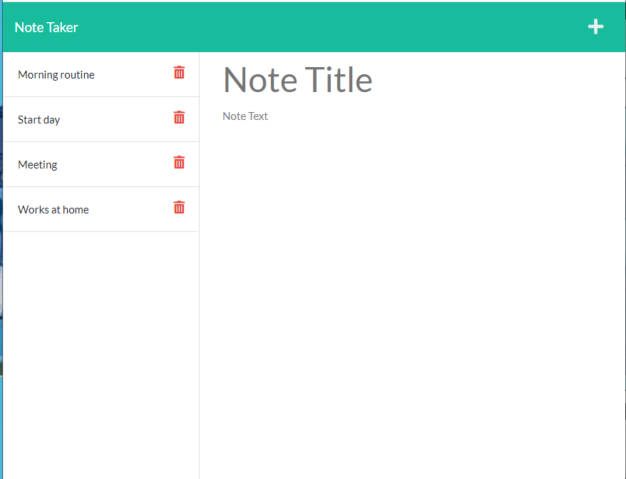
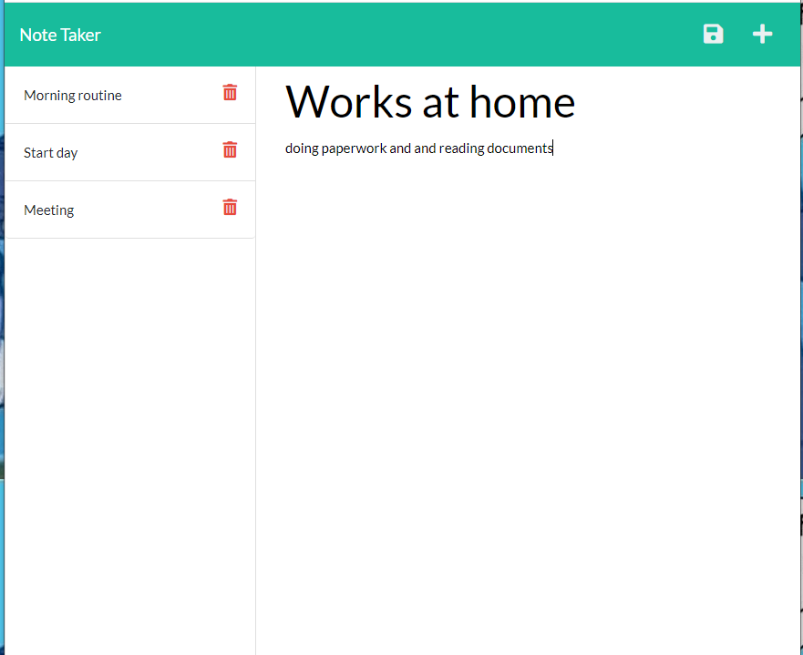

# Note Taker

## About

This is an application called Note Taker that can be used to write and save notes. 
## User Story

```
AS A small business owner
I WANT to be able to write and save notes
SO THAT I can organize my thoughts and keep track of tasks I need to complete
```

## Mock-Ups

The following images show the web application's appearance and functionality: 


| |  |
| --- | --- |
|  Mockup 1 | Mockup 2 |

## Work done screenshots of the page

| |  |
| --- | --- |
|  Work done 1 | Work done 2 |


## What's included
This application uses an Express.js back end and saves and retrieves note data from a JSON file.


## Links to Review


* The URL of the functional, deployed application on Heroku: https://note-taker-mvpie.herokuapp.com/

* The URL of the GitHub repository: https://github.com/MaryVPie/note-taker


## From developer
Made with :heart: by [MaryVPie](https://github.com/MaryVPie).
I'm always happy to receive your feedback!


